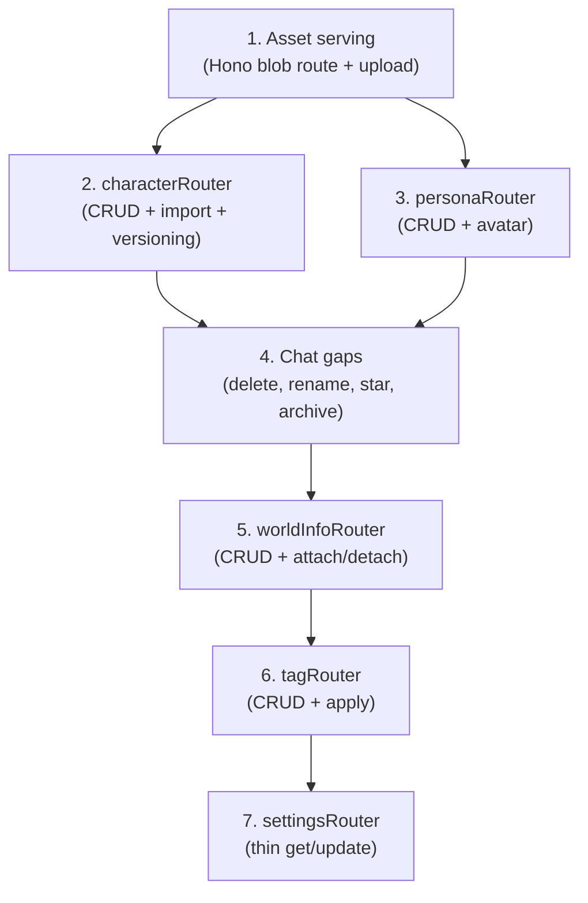

# Backend Gap Analysis: SillyTavern Domain Surface vs Neo-Tavern

> [!NOTE]
> Verified against the actual codebases on 2026-05-27. ST endpoints from `references/sillytavern/src/endpoints/`.
> Neo-tavern state from `src/server/trpc/`, `src/server/domain/`, and `src/db/schema.ts`.

## Legend

| Icon | Meaning |
|------|---------|
| ✅ | **Built** — tRPC router + domain service exist and work |
| 🔧 | **Domain service exists, no tRPC router** — logic is there but not exposed to the client |
| ❌ | **Missing** — DB schema exists but no domain service or router |
| ⛔ | **Not needed** — deliberately excluded per doctrine (YGWYG / single-user / architecture) |

---

## 1. Characters & Personas

### SillyTavern Surface (`/api/characters`)
ST has 13 endpoints for character management. Characters are PNG files with embedded JSON (V1/V2 card format). File-based, no database.

| ST Endpoint | What it does |
|---|---|
| `POST /all` | List all characters (parse PNGs from disk) |
| `POST /get` | Get one character by avatar filename |
| `POST /create` | Create character (write card JSON into PNG) |
| `POST /edit` | Full-edit character card fields |
| `POST /edit-avatar` | Replace avatar image only |
| `POST /edit-attribute` | Edit a single card field |
| `POST /merge-attributes` | Bulk deep-merge partial updates |
| `POST /rename` | Rename character file + cascade to chats/thumbnails |
| `POST /delete` | Delete character + associated chats + thumbnails |
| `POST /duplicate` | Clone a character PNG |
| `POST /import` | Import from PNG/JSON/YAML/CharX |
| `POST /export` | Export as PNG or JSON |
| `POST /chats` | List all chats for a character |

ST also has `/api/avatars` for **persona** management (3 endpoints: list, upload, delete).

### Neo-Tavern State

| Layer | Status | Details |
|---|---|---|
| **DB Schema** | ✅ | `characters`, `characterVersions` (copy-on-write versioning), `personas` — all defined with full FK chains |
| **Domain Service** | 🔧 Partial | `domain/import/` handles card parsing + bulk import from ST corpus. `domain/assets/` handles avatar storage in CAS. **No character CRUD service** (create/edit/delete/list individually) |
| **tRPC Router** | ❌ Missing | No `characterRouter`. Characters only enter the system via the CLI import pipeline |

### What to Build: `characterRouter`

| Procedure | Type | Purpose | ST Equivalent |
|---|---|---|---|
| `character.list` | query | Owner-scoped character list (with current version summary, avatar URL, starred/archived flags) | `POST /all` |
| `character.get` | query | Full character detail + current version (description, personality, scenario, greetings, tags, etc.) | `POST /get` |
| `character.create` | mutation | Create from card upload (PNG with embedded JSON) or manual fields. Creates character + initial version + CAS avatar asset | `POST /create` + `POST /import` |
| `character.update` | mutation | Edit character card fields. Copy-on-write: if current version is pinned by a chat, fork a new version | `POST /edit` + `POST /edit-attribute` |
| `character.updateAvatar` | mutation | Replace avatar image only (new CAS asset, update version FK) | `POST /edit-avatar` |
| `character.delete` | mutation | Soft-delete (archive) or hard-delete. Cascade considerations: chats RESTRICT on pinned versions | `POST /delete` |
| `character.star` | mutation | Toggle starred flag | — |
| `character.archive` | mutation | Toggle archived flag | — |
| `character.listChats` | query | All chats for a character (via `characterVersionId` join) | `POST /chats` |
| `character.export` | query | Export as PNG (with embedded card JSON) or raw JSON | `POST /export` |

### What to Build: `personaRouter`

| Procedure | Type | Purpose | ST Equivalent |
|---|---|---|---|
| `persona.list` | query | All user personas | `POST /avatars/get` |
| `persona.get` | query | One persona with avatar | — |
| `persona.create` | mutation | Create persona (name, description, avatar upload) | `POST /avatars/upload` |
| `persona.update` | mutation | Edit name/description/avatar | — |
| `persona.delete` | mutation | Delete persona. Chats SET NULL on `personaId` | `POST /avatars/delete` |

---

## 2. Chats & Messages

### SillyTavern Surface (`/api/chats`)
ST has 14 endpoints. Chats are JSONL files on disk. No database, no real-time streaming — save/load full files.

| ST Endpoint | What it does |
|---|---|
| `POST /save` | Save entire chat (write JSONL, integrity hash check) |
| `POST /get` | Load all chats for a character (read JSONL files) |
| `POST /rename` | Rename a chat file |
| `POST /delete` | Delete a chat file |
| `POST /export` | Export as txt/oai/json/jsonl |
| `POST /import` | Import from multiple formats (Kobold, CAI, oobabooga, Agnai, RisuAI, JSONL) |
| `POST /search` | Full-text search across a character's chats |
| `POST /recent` | Recently modified chats across all characters |
| `POST /group/*` | Group chat variants (get/save/delete/import/info) |

### Neo-Tavern State

| Layer | Status | Details |
|---|---|---|
| **DB Schema** | ✅ | `chats`, `messages`, `messageVariants`, `chatEvents` — full relational model with seq ordering, variants/swipes, fork links, provider provenance, token tracking |
| **Domain Service** | ✅ | `domain/chat/` — 19 files (~120KB). Full lifecycle: create, send (sdk + openrouter), swipe, selectVariant, editMessage, fork, setProvider, compact, memory injection, read ops |
| **tRPC Router** | ✅ | `chatRouter` with 12 procedures: create, list, get, messages, previewAssembly, send, setProvider, fork, swipe, selectVariant, editMessage, compact |

### Gap Analysis

| Feature | Status | Notes |
|---|---|---|
| Core CRUD (create/list/get/messages) | ✅ Built | |
| Send + stream response | ✅ Built | Optimistic concurrency via `expectedSeq` |
| Swipes / variants | ✅ Built | `swipe` + `selectVariant` |
| Edit message | ✅ Built | |
| Fork / branch | ✅ Built | `fork` with provider switching |
| Provider switching | ✅ Built | `setProvider` (api/source/model) |
| Compaction | ✅ Built | Manual + auto, sdk summary capture |
| Memory / digest injection | ✅ Built | Mix-A/B/C/tiered modes in `domain/chat/memory.ts` (31KB!) |
| Delete chat | ❌ Missing | No `chat.delete` procedure |
| Rename / retitle chat | ❌ Missing | No `chat.rename` or `chat.updateTitle` procedure |
| Star / archive chat | ❌ Missing | Schema has `starred`/`archived` columns, no mutations |
| Export chat | ❌ Missing | No export to any format |
| Import chat (individual) | 🔧 CLI only | `domain/import/` handles bulk ST import, not individual upload |
| Search within chats | ✅ Built | Via `searchRouter` (semantic, not text) — more powerful than ST's grep |
| Recent chats | ✅ Built | `chat.list` returns newest-updated first |
| Group chats | ⛔ Not needed | Architecture doesn't include group chat concept |

---

## 3. Presets

### SillyTavern Surface (`/api/presets`)
ST has 3 endpoints. Presets are flat JSON files, one per provider type (openai, kobold, novel, etc.).

| ST Endpoint | What it does |
|---|---|
| `POST /save` | Save preset JSON to provider-specific directory |
| `POST /delete` | Delete a preset file |
| `POST /restore` | Restore a default preset from template |

### Neo-Tavern State

| Layer | Status | Details |
|---|---|---|
| **DB Schema** | ✅ | `presets`, `presetVersions` — identity/version split with copy-on-write semantics. Versioned `PromptConfig` blob |
| **Domain Service** | ✅ | `domain/preset/` — full CRUD with copy-on-write version pinning |
| **tRPC Router** | ✅ | `presetRouter` with 5 procedures: list, get, create, update, remove |

### Gap Analysis

| Feature | Status | Notes |
|---|---|---|
| List / get / create / update / delete | ✅ Built | |
| Copy-on-write versioning | ✅ Built | If a version is pinned by a chat/message, editing forks a new version |
| Provider-agnostic | ✅ Built | Single `PromptConfig` schema with ordered sections + markers, not per-provider files |
| Restore defaults | ❌ Missing | Could ship `DEFAULT_PROMPT_CONFIG` as a reset, but low priority |
| Duplicate preset | ❌ Missing | Minor convenience feature |

---

## 4. World Info / Lorebooks

### SillyTavern Surface (`/api/worldinfo`)
ST has 5 endpoints. World info files are standalone JSON, plus character-embedded `character_book`.

| ST Endpoint | What it does |
|---|---|
| `POST /list` | List all lorebooks + character-embedded books |
| `POST /get` | Get a single lorebook by name |
| `POST /edit` | Save/update a lorebook |
| `POST /delete` | Delete a lorebook |
| `POST /import` | Import from JSON file upload |

### Neo-Tavern State

| Layer | Status | Details |
|---|---|---|
| **DB Schema** | ✅ | `worldBooks`, `worldEntries`, `chatWorldEntries` (attach to chats), `characterVersionWorldEntries` (attach to character versions) — full relational model with explicit attachment (no keyword scanning) |
| **Domain Service** | 🔧 Import only | `domain/import/` creates world entries from ST character_book during corpus import. No standalone CRUD service |
| **tRPC Router** | ❌ Missing | No `worldInfoRouter` |

### What to Build: `worldInfoRouter`

| Procedure | Type | Purpose | ST Equivalent |
|---|---|---|---|
| `worldInfo.listBooks` | query | All lorebooks for the owner | `POST /list` |
| `worldInfo.getBook` | query | One book with all its entries | `POST /get` |
| `worldInfo.createBook` | mutation | Create a new lorebook | — |
| `worldInfo.updateBook` | mutation | Rename/update book metadata | `POST /edit` (partial) |
| `worldInfo.deleteBook` | mutation | Delete book (cascade deletes entries) | `POST /delete` |
| `worldInfo.createEntry` | mutation | Add an entry to a book | `POST /edit` (ST overwrites entire file) |
| `worldInfo.updateEntry` | mutation | Edit entry content/title/priority/enabled | `POST /edit` |
| `worldInfo.deleteEntry` | mutation | Remove an entry | `POST /edit` |
| `worldInfo.attachToChat` | mutation | Link a world entry to a chat (with scope/pin) | — (ST uses keyword scanning) |
| `worldInfo.detachFromChat` | mutation | Unlink | — |
| `worldInfo.attachToCharacter` | mutation | Link a world entry to a character version | — |
| `worldInfo.detachFromCharacter` | mutation | Unlink | — |

---

## 5. Assets (Avatars, Card PNGs)

### SillyTavern Surface
ST scatters asset management across `/api/characters` (card PNGs), `/api/avatars` (persona images), `/api/backgrounds`, `/api/sprites`, `/thumbnail`. All file-based.

### Neo-Tavern State

| Layer | Status | Details |
|---|---|---|
| **DB Schema** | ✅ | `assets` table (kind: card/avatar/export, CAS hash-keyed, no path column — locator IS the hash) |
| **Domain Service** | 🔧 Exists | `domain/assets/service.ts` — `store()`, `backfillAvatars()`, `collectGarbage()`, `fsck()`, `rebuildFromTree()`. CAS blob store (`server/storage/cas.ts`) handles I/O |
| **Hono Route** | 🔧 Debug only | `fsck` exposed via `/api/_debug/db/assets`. No upload/download routes for the client |
| **tRPC Router** | ❌ Missing | No `assetRouter` |

### What to Build: Asset serving + upload

| Endpoint | Type | Purpose |
|---|---|---|
| `GET /api/blob/:hash` | Hono route | Serve a CAS blob by hash (avatar/card images). This is the `BLOB_ROUTE` already defined in `shared/assets.ts` |
| `asset.upload` | tRPC mutation | Upload an image file → CAS store → return asset id + hash. Used by character create/edit and persona create/edit |

> [!IMPORTANT]
> File uploads go through Hono (multipart), not tRPC. The tRPC mutation would handle the metadata side after the upload route stores the blob.

---

## 6. Tags

### SillyTavern Surface
ST doesn't have a dedicated tag endpoint — tags are embedded in character card JSON and managed client-side.

### Neo-Tavern State

| Layer | Status | Details |
|---|---|---|
| **DB Schema** | ✅ | `tags` (id, name, color, source: manual/auto), `taggables` (polymorphic: tagId + entityType + entityId) |
| **Domain Service** | ❌ Missing | No tag service |
| **tRPC Router** | ❌ Missing | No `tagRouter` |

### What to Build: `tagRouter`

| Procedure | Type | Purpose |
|---|---|---|
| `tag.list` | query | All tags for the owner |
| `tag.create` | mutation | Create a tag (name, color) |
| `tag.update` | mutation | Rename / recolor |
| `tag.delete` | mutation | Delete tag (cascade removes taggables) |
| `tag.apply` | mutation | Attach tag to an entity (character, chat, book) |
| `tag.remove` | mutation | Detach tag from an entity |
| `tag.listFor` | query | All tags for a given entity |

---

## 7. Settings

### SillyTavern Surface (`/api/settings`)
ST has 6 endpoints. Settings are a monolithic JSON blob + snapshot backups.

### Neo-Tavern State

| Layer | Status | Details |
|---|---|---|
| **DB Schema** | ✅ | `userSettings` (userId, schemaVersion, config JSON blob, updatedAt) + `settings` (global key/value) |
| **Domain Service** | ❌ Missing | No settings service |
| **tRPC Router** | ❌ Missing | No `settingsRouter` |

### What to Build: `settingsRouter` (thin)

| Procedure | Type | Purpose |
|---|---|---|
| `settings.get` | query | Current user settings blob |
| `settings.update` | mutation | Patch user settings (validate schema version, merge) |

> [!TIP]
> Keep this razor-thin per YGWYG doctrine. No snapshots, no per-provider preset directories. The config blob schema + migrations handle versioning.

---

## 8. Deliberately Excluded (⛔ Not Needed)

These ST features are explicitly out of scope per neo-tavern's doctrine:

| ST Feature | Why Excluded |
|---|---|
| **Backgrounds** (`/api/backgrounds`) | YGWYG — one polished dark theme, no customizable backgrounds |
| **Sprites** (`/api/sprites`) | Visual novel sprites — not in scope |
| **Themes** (`/api/themes`) | Single dark theme, no switcher |
| **Quick Replies** (`/api/quick-replies`) | Not planned |
| **External Search Proxies** (`/api/search`) | ST proxies SerpApi/SearXNG/etc. for tool use. Neo-tavern doesn't need this — corpus/RAG is the search layer |
| **Tokenizers** (`/api/tokenizers`) | ST needs client-side token counting across many backends. Neo-tavern counts server-side in providers |
| **Stats** (`/api/stats`) | ST re-scans JSONL files to compute stats. Neo-tavern has `totalTokensIn/Out`, `messageCount` on the `chats` table + per-message token columns — analytics queries, not a separate endpoint |
| **Files** (`/api/files`) | Generic file hosting for chat attachments — not in current scope |
| **Backups** (`/api/backups`) | Chat backup management — DB-level backup strategy instead |
| **Groups** (`/api/groups`) | Group chats — not in current architecture |
| **User Admin** (`/api/users`) | Single user behind Authentik |
| **Secrets** (`/api/secrets`) | API keys in env vars, not a secrets store |
| **Per-provider backends** | OpenRouter + Agent SDK cover everything |

---

## Summary: What's Left to Build

### New tRPC Routers Needed

| Router | Priority | Complexity | Depends On |
|---|---|---|---|
| **`characterRouter`** | 🔴 Critical | Medium-High | `assetRouter` (avatar uploads) |
| **`personaRouter`** | 🔴 Critical | Low | `assetRouter` (avatar uploads) |
| **`assetRouter`** + blob serve route | 🔴 Critical | Medium | — (foundation for character + persona) |
| **`worldInfoRouter`** | 🟡 High | Medium | — |
| **`tagRouter`** | 🟢 Medium | Low | — |
| **`settingsRouter`** | 🟢 Medium | Low | — |

### Missing Procedures on Existing Routers

| Router | Missing Procedure | Priority |
|---|---|---|
| `chatRouter` | `chat.delete` | 🔴 Critical |
| `chatRouter` | `chat.updateTitle` | 🟡 High |
| `chatRouter` | `chat.star` / `chat.archive` | 🟡 High |
| `chatRouter` | `chat.export` | 🟢 Medium |
| `presetRouter` | `preset.duplicate` | 🟢 Low |

### Suggested Build Order

> [!IMPORTANT]
> Assets must come first — both characters and personas need avatar upload/serve before their routers are useful. The blob-serve Hono route (`GET /api/blob/:hash`) is the foundation that lets the frontend display any image.
