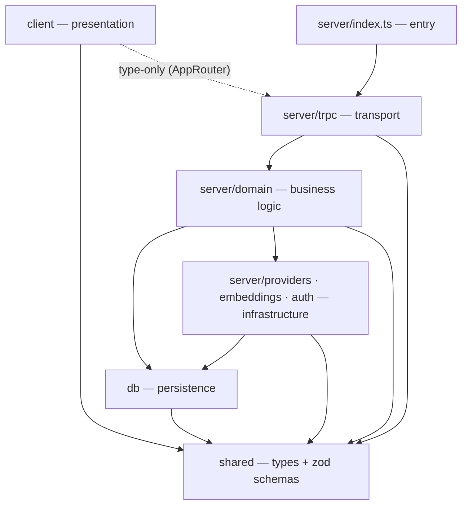

# Architecture — the layer cake

This is the source of truth for **where code lives** and **which way dependencies
flow**. It is not aspirational: the directions below are **machine-enforced** by
`dependency-cruiser` (`pnpm arch`, part of `pnpm check` and the pre-commit hook).
Anything that imports "upward" or sideways across a boundary fails the build.

## Layers (low → high)

A layer may import anything **below** it, never above or sideways.

| Layer | Path | Purpose | May import |
| --- | --- | --- | --- |
| **shared** | `src/shared/` | Types + Zod schemas shared across the client/server boundary. The foundation. | external only |
| **db** | `src/db/` | Drizzle schema + libSQL client + migrations. | shared |
| **infrastructure** | `src/server/{providers,embeddings,auth,storage}/`, `src/server/env.ts` | Adapters to external systems (Claude SDK, OpenRouter, embeddings, the CAS blob store), auth header trust, config. | db, shared (`storage` = shared only, no db) |
| **domain** | `src/server/domain/` | Business logic (chats, characters, corpus search). Orchestrates infrastructure. | infrastructure, db, shared |
| **drivers** | `src/server/trpc/` · `src/server/jobs/` | THIN drivers that call **down** into domain — tRPC transport (request/response) and background jobs (corpus embedding pass, agent jobs). Reach db/infra **only through domain**; the two never import each other. | domain, shared (+ env, version) |
| **entry** | `src/server/index.ts` | Hono composition root. Wires drivers + serves the client. | everything server |
| **client** | `src/client/` | React / TanStack presentation. | shared; server **as types only** (tRPC `AppRouter`) |

The one cross-boundary exception: the client may `import type` from the server
(that's how it gets the tRPC `AppRouter` type) — but a **runtime** import from
client → server/db fails `arch`. Verified: type-only passes, value imports are caught.

### Within the client

A second cake, enforced the same way — and it mirrors the server: **routes are to
the client what tRPC is to the server** (thin entry → call into a feature), and
**`client/features/` is to the client what `domain/` is to the server.**

| Sub-layer | Path | May import |
| --- | --- | --- |
| **lib** | `src/client/lib/` | shared, external, server-types (foundation) |
| **state** | `src/client/state/` | lib, shared, external (global app state) |
| **hooks** | `src/client/hooks/` | lib, state, shared (shared hooks) |
| **ui primitives** | `src/client/components/ui/` | lib, shared, other primitives (app-agnostic) |
| **shared components** | `src/client/components/` | ui, lib, state, hooks, shared |
| **features** | `src/client/features/<feature>/` | components, ui, lib, state, hooks, shared, server-types |
| **routes** | `src/client/routes/` | a feature (via its index), components, lib, state — imported only by the generated route tree |

The foundation/shared tiers (`lib`, `state`, `hooks`, `components`) never import a
feature; routes do (that's their job). A route file is trivial:

```tsx
// routes/chats/$chatId.tsx — thin: URL → a feature's page
import { createFileRoute } from "@tanstack/react-router";
import { ChatPage } from "../../features/chat"; // feature index = its front door
export const Route = createFileRoute("/chats/$chatId")({ component: ChatPage });
```

### Features (server domain + client) are independent

Both `domain/<feature>/` and `client/features/<feature>/` are isolated: one feature
must not import another's internals (`*-no-cross-feature`), and callers above a
feature enter it **only through its `index.ts`** (`*-feature-front-door`).
Cross-feature helpers live in `_shared/`. These index files are the *only*
sanctioned barrels — see "the barrel tradeoff" below.



## Folder map

```
src/
├── shared/              # FOUNDATION — types + schemas (client + server)
│   ├── schemas/         #   zod schemas shared across the boundary
│   ├── models.ts        #   sdk-mode chat model catalog (latest Claude per tier)
│   ├── prompt-config.ts #   PromptConfig (the versioned preset blob: sections + cache boundary)
│   └── prompt-assemble.ts #  pure assemblePrompt(config, ctx) → static/dynamic system prompt
├── db/                  # PERSISTENCE (Phase 2)
│   ├── schema.ts        #   Drizzle tables
│   ├── client.ts        #   libSQL connection
│   └── migrations/
├── server/
│   ├── env.ts           #   config boundary (the only reader of process.env)
│   ├── index.ts         #   ENTRY — Hono composition root
│   ├── auth/            # INFRA — X-Authentik-Username trust
│   ├── providers/       # INFRA — claude-sdk.ts, openrouter.ts
│   ├── embeddings/      # INFRA — BGE-M3 / vectors (Phase 3)
│   ├── storage/         # INFRA — content-addressed blob store (cas.ts) — shared-only, NO db
│   ├── domain/          # BUSINESS LOGIC — one dir per feature
│   │   ├── _shared/     #   cross-feature domain helpers (the only shared escape)
│   │   └── <feature>/   #   assets/, chat/, corpus/, debug/, import/, models/, search/ — entered via index.ts
│   ├── jobs/            # DRIVER — IN-SERVER background workers (reach db only via domain)
│   └── trpc/            # DRIVER — transport
│       ├── context.ts
│       ├── router.ts    #   root router
│       └── routers/     #   feature routers (chats, characters, search)
└── client/              # PRESENTATION
    ├── main.tsx         #   entry
    ├── routes/          #   TanStack file-based routes — THIN (URL → a feature page)
    ├── features/        #   FEATURE SLICES (the substance) — mirrors server domain
    │   ├── _shared/     #     cross-feature client helpers (the only escape)
    │   └── <feature>/   #     chat/, corpus-search/, … — entered via index.ts
    ├── components/      #   shared cross-feature components
    │   └── ui/          #     shadcn primitives live HERE
    ├── hooks/           #   shared hooks (useMediaQuery, …)
    ├── lib/             #   trpc client, cn(), utils — foundation
    ├── state/           #   global zustand stores
    └── styles/          #   globals.css (Tailwind v4 @theme tokens)
```

Empty directories are `.gitkeep`-stubbed to lock the layout. Files are created
when their feature lands — and slot into the enforced layer automatically.

**`scripts/` (repo root, NOT cruised) = composition-root CLIs.** One-shot tools that
bootstrap their own `createDb` + services and call **down** into domain — `import-st.ts`,
`embed-corpus.ts`, probes. They are NOT `jobs/`: the `drivers-through-domain` rule bars
`jobs/` from importing `db` *at all* (even type-only), so a db-bootstrapping CLI can't live
there. Like `server/index.ts`, a script is an entry point that wires the graph; `jobs/` stays
for thin **in-server** background workers. `tools/` (root) holds the uv-vendored CUDA runtime
(`tools/cuda/`) — not application code.

## Enforcement

`.dependency-cruiser.cjs` extends `recommended-strict` and adds the rules below
(all `error`, each proven to fire on a planted violation):

- **Layer direction:** `shared-is-foundation`, `db-is-foundation`,
  `client-no-backend-runtime` (type-only exception), `server-no-client`,
  `below-drivers-no-driver`, `infra-below-domain`, `storage-is-blob-io` (the CAS adapter imports
  shared only — never db/domain/drivers), `drivers-through-domain`, `no-cross-driver`.
- **Client internals:** `client-lib-is-foundation`, `client-state-below-view`,
  `client-ui-is-pure`, `client-routes-are-leaves`, `client-foundations-no-features`.
- **Features (server + client):** `domain-no-cross-feature`,
  `domain-feature-front-door`, `client-no-cross-feature`, `client-feature-front-door`.
- **Hygiene:** `not-to-dev-dep` (.d.ts/type-only exempt), `not-to-test`, plus the
  inherited no-circular / not-to-unresolvable.

Commands:

- **`pnpm arch`** — validates all of the above. Runs inside `pnpm check` and the
  pre-commit hook.
- **`pnpm arch:graph`** — regenerates the live module graph to `docs/dependency-graph.mmd`.
- Dead code is owned by **`pnpm knip`** (dependency-cruiser's orphan check is a
  secondary warning).

## Layer public APIs — the barrel tradeoff (a deliberate exception)

We default to **no barrel files** (`noBarrelFile` + `noReExportAll` in Biome) —
they hurt tree-shaking and breed import cycles. But "enter a layer only through
its front door" requires a public-API file to enter *through*. So there is **one
sanctioned exception**: a feature's `index.ts` (server domain features *and*
client features).

- The `*-feature-front-door` rules (dependency-cruiser) forbid any caller above a
  feature from importing its internals — they must import `<feature>` (which
  resolves to `index.ts`) or `_shared`.
- Biome's `noBarrelFile`/`noReExportAll` are therefore scoped **off** for
  `src/server/domain/*/index.ts` and `src/client/features/*/index.ts` only
  (see `biome.jsonc` overrides).

**Why scoped to features and nowhere else:** features are the multi-file units
with internals worth hiding; the flat layers (`providers`, `embeddings`, `auth`,
`lib`, `state`) are imported directly and gain nothing from a barrel. The barrel
risk (cycles) is still covered globally by `no-circular`. This is the one place we
trade the no-barrel default for a clean public API — intentionally, here, and
nowhere else.

## Note on the brief

The original brief put business logic directly in tRPC routers. We inserted a
dedicated **`domain/`** layer (transport stays thin) to match the CardRefinery
layering and to give the cake a clean place for logic. If you'd rather collapse
domain back into the routers, drop `src/server/domain/` and the two `domain`
rules in `.dependency-cruiser.cjs`.
```
