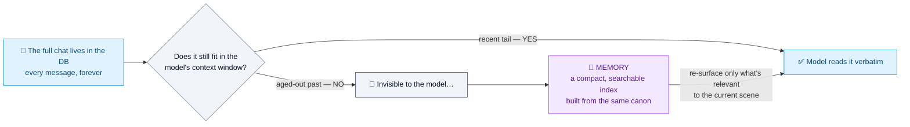
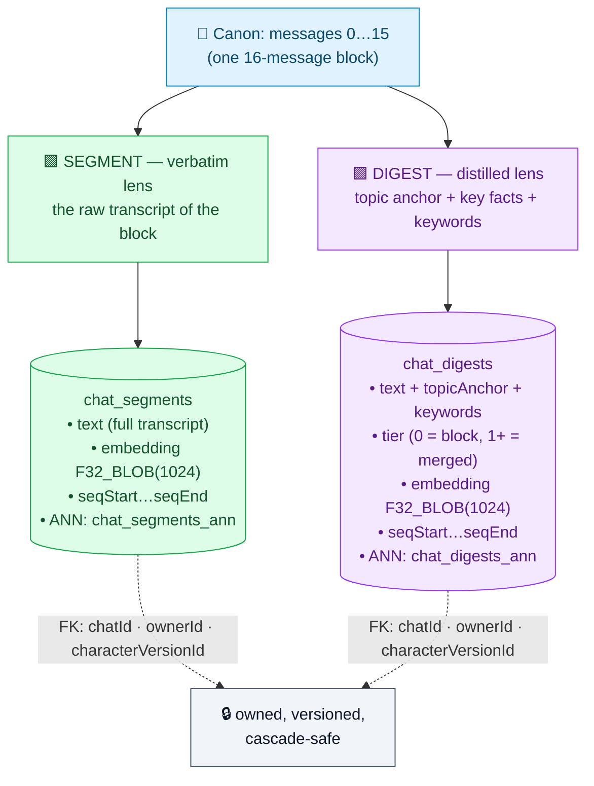
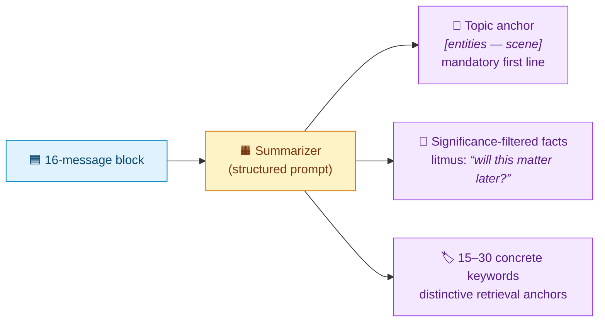
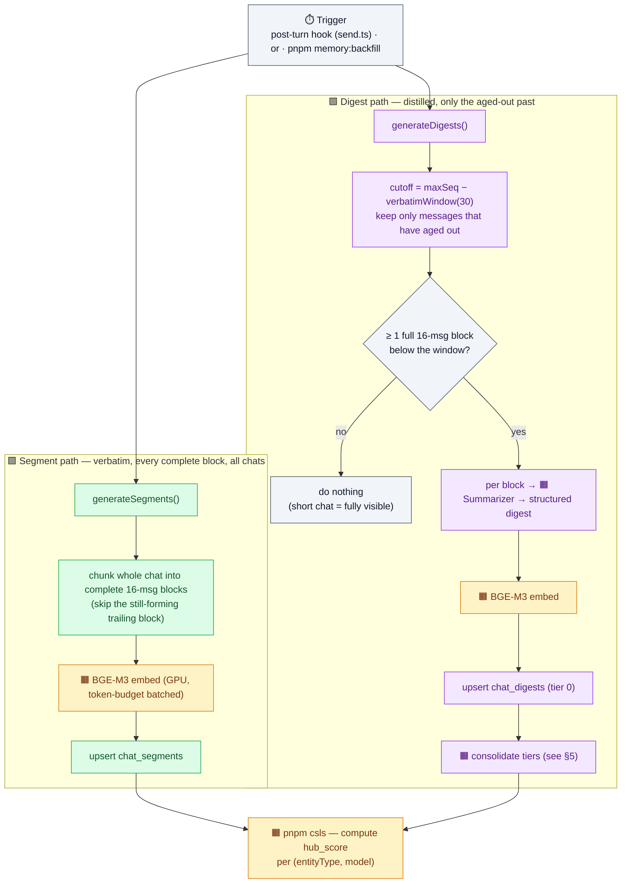
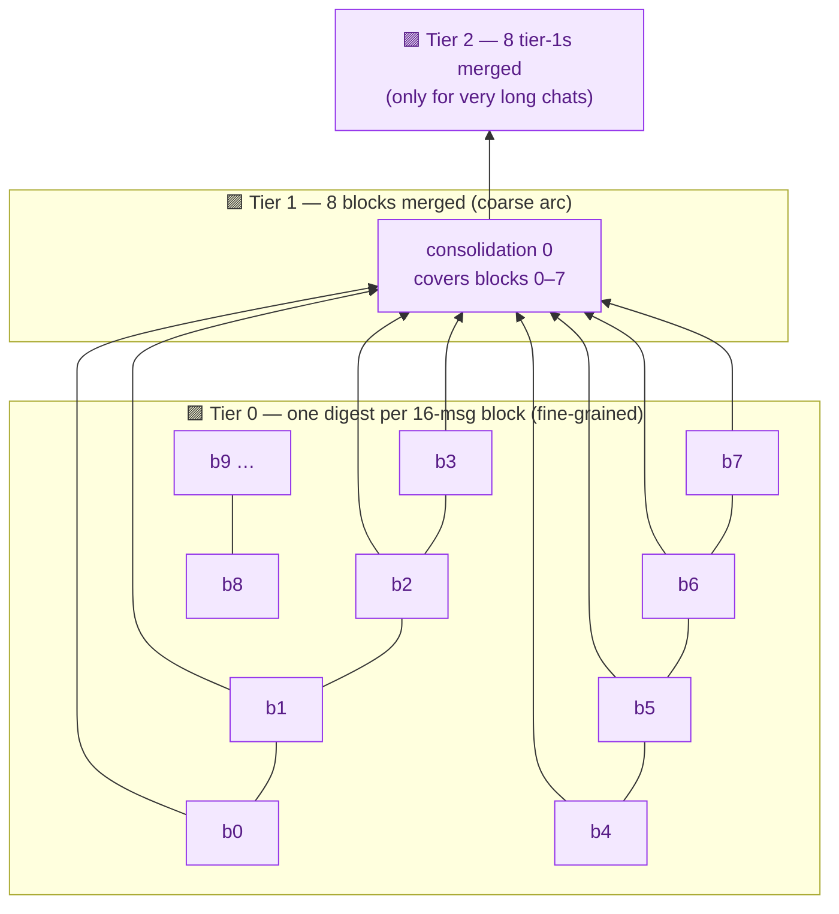
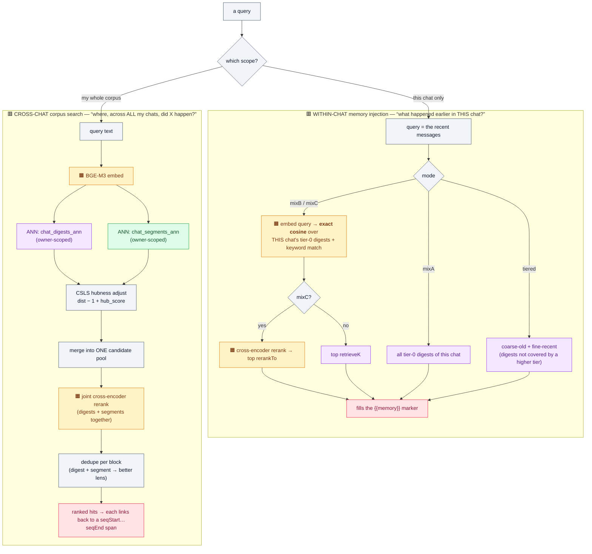
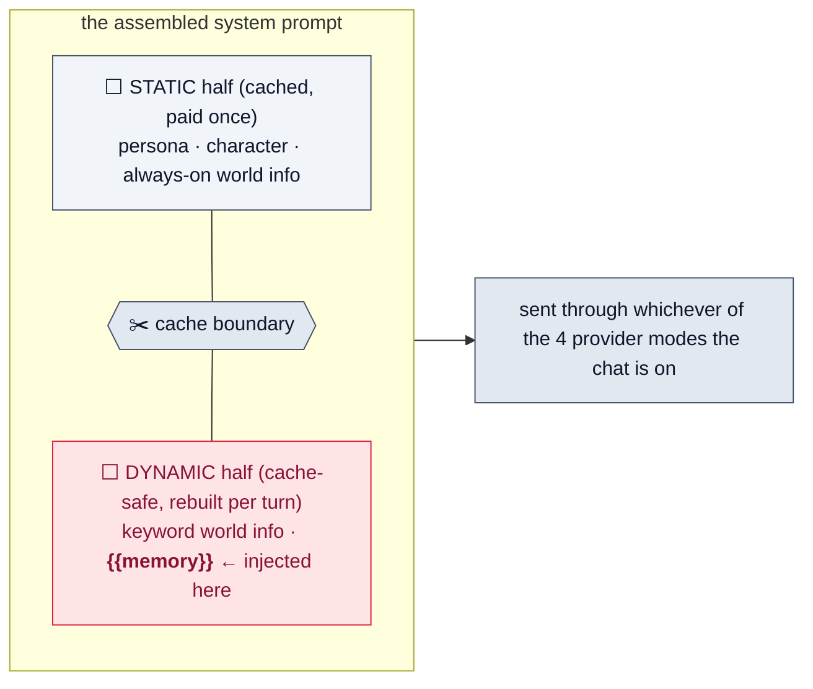
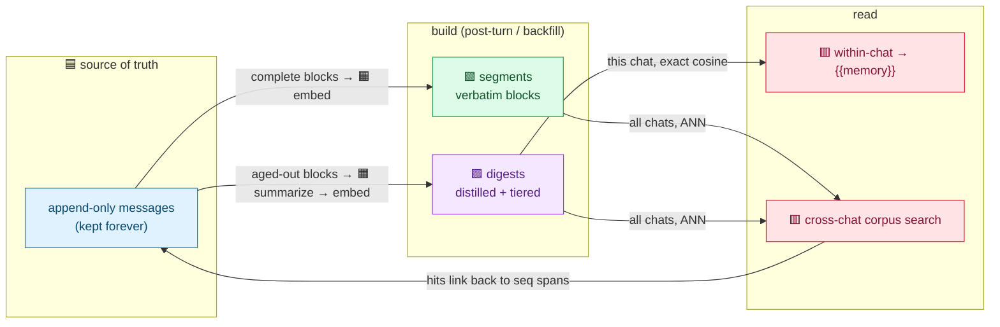

# The neo-tavern memory system — a visual guide

> A show-and-tell companion to the design record in **`docs/memory.md`**. This file is all
> pictures + plain language: hand it to someone and they should be able to *see* how the whole
> thing works without reading a line of code. Every diagram is colour-coded to one legend (below).

## Colour legend

| Colour | Means |
|---|---|
| 🟦 **Canon** | The append-only message log — the source of truth, kept forever |
| 🟩 **Segment** | A *verbatim* 16-message block (raw transcript, embedded) |
| 🟪 **Digest** | A *distilled* structured summary of a block (anchor + facts + keywords, embedded, tiered) |
| 🟧 **Model** | A local/hosted model doing work (embedder, reranker, summarizer) |
| 🟥 **Read path** | Retrieval + what the user/model ultimately receives |
| ⬜ **Prompt / infra** | Prompt assembly, gating, plumbing |

---

## 1. The one idea

Everything below exists to serve a single insight:

> **Canon is append-only and kept *forever*. The model's context window only sees the recent
> tail — older turns fall out of *visibility*, not existence. Memory is the regenerable,
> high-signal index that reaches back past the window and pulls the relevant past forward.**



**Memory is orthogonal to compaction.** Compaction (native to the agent-SDK runner) compresses
what's *inside* the window when it fills up. Memory is a *different axis* — it recovers what's
already *fallen out*. Because of that, memory works in **all four provider modes**, including the
OpenRouter chat-completions / responses modes that have no compaction at all.

---

## 2. The substrate — one boundary, two lenses

Every chat is sliced into fixed **16-message blocks**. Each completed block is captured through
**two complementary lenses**, stored as two first-class, foreign-keyed, vector-indexed tables:



**Why two?** A raw 16-message chunk embeds *noisily* — every chunk looks vaguely similar, so
similarity search returns mush. The digest distills the **load-bearing signal**, so it retrieves
cleanly. We keep **both, permanently, linked** by the same `(chatId, blockIdx, seq-span)`: the
digest is the sharp search key; the segment is the verbatim ground truth it points back to.

---

## 3. What a *digest* actually is

A tier-0 digest is not a paragraph summary. It's a **structured, retrieval-optimised** unit with
three parts, produced under a strict prompt:



**A real digest the pipeline produced** (block 2 of a 222-message chat; one character renamed for sharing):

```
[Wyatt & Bess — Midnight Crossing, the Unleashed RX-78-2]
- Wyatt revealed he bought a Bandai PG Perfect Grade Unleashed RX-78-2 Gundam ($350, 3,500 pieces) as his first kit — deliberately, to make Bess come help him build it.
- Bess committed to building the Unleashed with him and declared it nonnegotiable.
- Wyatt started watching Mobile Suit Gundam SEED (the "wrong" entry point) on purpose to bait Bess into coming over.
- Bess crossed the street at 11:42 PM, walked in without knocking, and took the tablet to stop him — they settled on 08th MS Team instead.
keywords: Unleashed RX-78-2, Perfect Grade, $350 kit, 3,500 pieces, Gundam SEED,
          08th MS Team, midnight crossing, build-it-together, foreclosure house, Samui
```

Keywords like *"Unleashed RX-78-2"* or *"08th MS Team"* are exactly the kind of
distinctive tokens that retrieve precisely — which a raw transcript chunk would bury.

---

## 4. The write path — how memory gets built

Both lenses are generated **after a turn completes** (fire-and-forget, never blocking the reply)
*and* in bulk by the backfill script for imported history. Same functions, same result.



**The summarizer is free-first:** a local **Qwen3-4B-Instruct GGUF** (in-process, node-llama-cpp)
when configured, otherwise a hosted **Claude Haiku** fallback over the existing chat-completions
runner. The embedder/reranker run in-process on the homelab GPUs (onnxruntime CUDA).

**It self-heals.** A block is only re-digested if it's **missing or stale** — its seq-span changed,
or a message in it was edited *after* the digest was written. Swipes/edits at the live tip never
touch settled digests (that's what the 30-message verbatim window protects), and a fork lazily
rebuilds only what diverged.

---

## 5. The tiering — keeping "the story so far" bounded

If we injected *every* tier-0 digest, a 1000-message chat would inject 60+ of them. Instead, blocks
**consolidate upward**: every `fanOut = 8` lower-tier digests merge into one coarser digest, with a
delta prompt (*"here are prior consolidations — do NOT repeat them"*). The arc stays compact as the
chat grows.



The tier-1 anchor for blocks 0–7 of that same chat read:
*"[Wyatt & Bess — Twelve Years Later: a Reunion, a Gundam Build, and Old Family History]"* — a
genuine cross-block synthesis, not a concatenation.

This is what the **`tiered`** read mode (next section) consumes: a **bridge** of coarse high-tier
digests for the distant past + fine tier-0 digests for the recent past — so the injected
"story so far" stays at a roughly constant token budget no matter how long the chat runs.

---

## 6. Two scopes, two read paths

The **same substrate** serves two very different questions. This is the heart of the system.



| | **Within-chat injection** | **Cross-chat corpus search** |
|---|---|---|
| Question | "What happened earlier in *this* chat?" | "Where, across *all* my chats, did X happen?" |
| Scope | one chat | the whole owner corpus |
| Match | **exact in-process cosine** (small, this chat) | **global ANN** (`vector_top_k`) + **CSLS** |
| Sources | tier-0 digests | **all digests *and* all segments** (hybrid) |
| Reranks | optional (mixC) | yes — one joint list |
| Output | text that fills `{{memory}}` | ranked hits → `seq` spans back to canon |

> **CSLS** corrects "hub" vectors — a few generic digests that sit suspiciously close to
> *everything* — by penalising them with a per-group hubness score, so true relevance wins.

**Retrieval in action** — real queries run against that chat's 13 digests (the within-chat path:
embed the query, cosine over tier-0):

| Query | Top digest surfaced | sim |
|---|---|---|
| *"which Gundam kit did they decide to build together?"* | block 2 — *[Wyatt & Bess — Midnight Crossing]* (names the Unleashed RX-78-2) | 0.53 |
| *"the night she ran across the street to stop him watching the wrong show"* | block 2 — *[Wyatt & Bess — Midnight Crossing]* | 0.56 |
| *"the four-hour garage talk about building mobile suits"* | block 1 — *[Wyatt & Bess — Garage reunion]* | 0.62 |

Note the discrimination: the *general* "mobile suits" talk pulls **block 1**, while the *specific*
build-night decision pulls **block 2** — two adjacent, topically-similar blocks stay cleanly
separable because the anchors + keywords give each a distinct fingerprint. Raw-chunk embeddings,
which all collapse toward the same "two people chatting" vector, can't make that split.

---

## 7. Where the injected memory lands

Within-chat retrieval fills the `{{memory}}` marker, which lives in the **dynamic (cache-safe)**
half of the system prompt — *after* the cache boundary — so the per-turn memory set never busts the
cached static prefix.



---

## 8. The whole thing, end to end



---

## 9. Built today vs. enabled later

The substrate above is the hard part, and it's **built and validated**. A few features sit *on top*
of it with zero rework required — the design deliberately doesn't preclude them:

| ✅ Built | 🔜 Enabled later (substrate-ready) |
|---|---|
| Structured tier-0 digests + hierarchical consolidation | **Trackers** — a single entry that updates in place (relationship status, inventory, plot threads) |
| Verbatim `chat_segments` + the hybrid corpus search | **Clips** — user-pinned one-off facts |
| CSLS hubness on both tables | **User-curated long-term promotion** — hand-pick what persists |
| Edit/fork-aware lazy regeneration | Per-chat summarizer profiles |

Because every digest is a **pure function of canon**, none of these risk corrupting the source of
truth — they're just additional lenses over the same append-only log.

---

### Knobs (all per-preset, surfaced in the UI later)

`blockSize` (16) · `verbatimWindow` (30) · `mode` (off / mixA / mixB / mixC / tiered) ·
`fanOut` (8) · `maxTier` (2) · `retrieveK` · `rerankTo` · `minScore` · `keywordMatch` ·
`summarizer` (local-or-hosted, maxTokens, temperature).

*Authoritative prose + rationale: `docs/memory.md`. Schema: `src/db/schema.ts`.*
